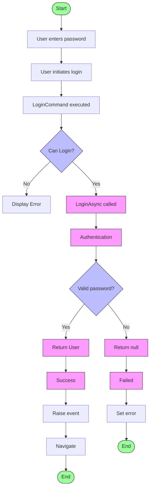
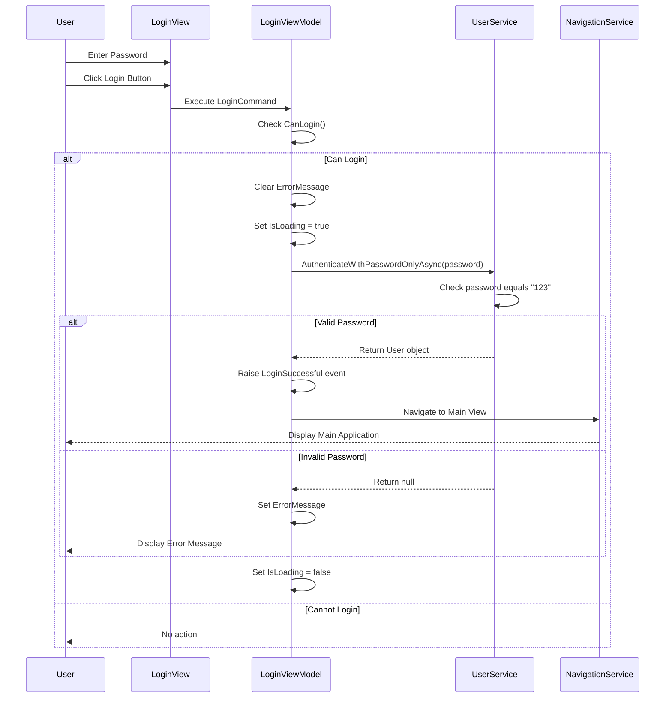

# Login Flow Documentation

This document outlines the detailed flow of the login system for the Khouissi-Caisse application.

## Login Flow Diagram

## Detailed Login Flow

## Detailed Component Description

### 1. UI Layer (View)
- **LoginView.xaml**: Provides the user interface for login with a password field and login button
- **Events**: 
  - Button click triggers login
  - Enter key in the password field triggers login

### 2. ViewModel Layer
- **LoginViewModel.cs**: Handles the login logic
  - **Properties**:
    - `Password`: Binds to the password input field
    - `ErrorMessage`: Displays authentication errors
    - `IsLoading`: Indicates if authentication is in progress
  - **Commands**:
    - `LoginCommand`: Executes the login process
    - `CancelCommand`: Clears the login form

### 3. Service Layer
- **IUserService.cs**: Interface defining authentication methods
- **MockUserService.cs**: Implementation that provides mock authentication
  - `AuthenticateWithPasswordOnlyAsync()`: Validates the password ("123")
  - Returns User object on success, null on failure

### 4. Navigation
- **NavigationService.cs**: Handles UI navigation after successful login
  - Creates and shows the appropriate view after login
  - Sets DataContext for the new view

### 5. Authentication Flow
1. User enters password and clicks login button or presses Enter
2. `LoginCommand` executes if password is not empty and not already loading
3. `LoginAsync()` method is called:
   - Clears any previous error messages
   - Sets `IsLoading` to true
   - Calls `AuthenticateWithPasswordOnlyAsync()` with the password
4. MockUserService checks if password equals "123"
5. If authentication succeeds:
   - LoginSuccessful event is raised
   - NavigationService navigates to the main application view
6. If authentication fails:
   - Error message is displayed
   - `IsLoading` is set back to false
7. Exception handling occurs at every step with appropriate error messages

## Security Considerations

- This implementation uses a simple mock login with a hard-coded password ("123") for development purposes
- In production, this should be replaced with proper authentication services
- Password should be securely hashed, not stored or compared in plain text
- Multiple failed login attempts should be tracked and limited

## Integration Points

- The login system integrates with:
  - User management system (currently mocked)
  - Navigation service for application flow
  - UI framework for visual feedback
