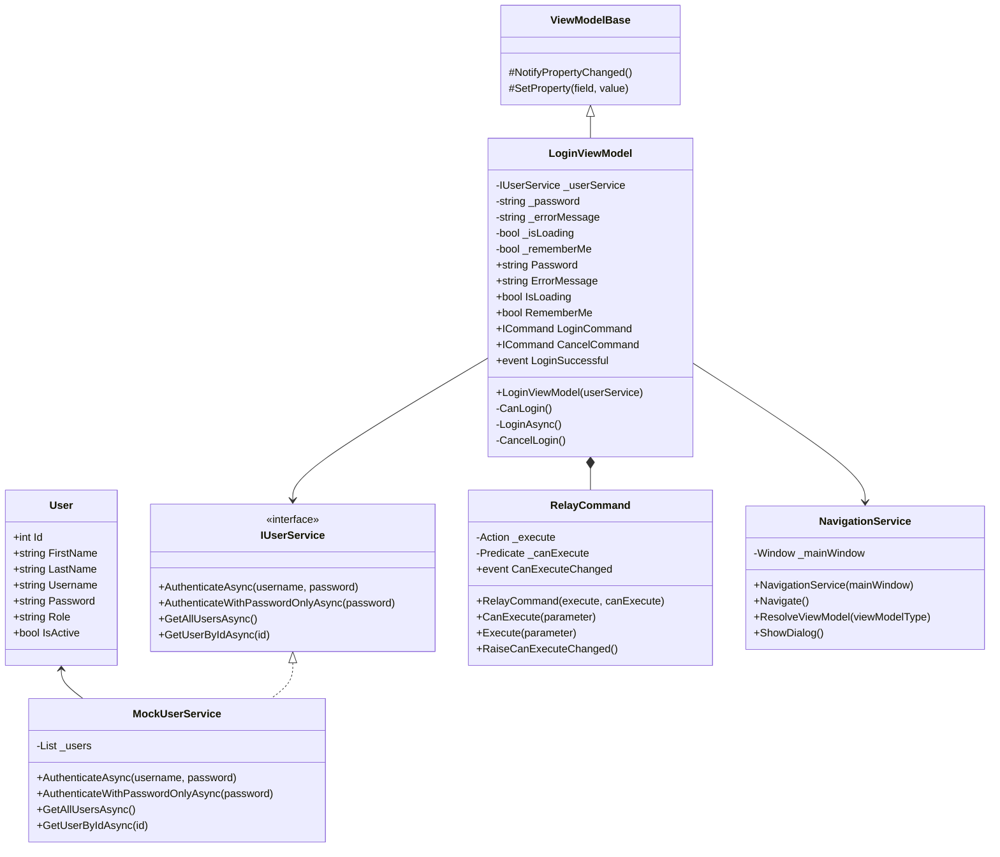
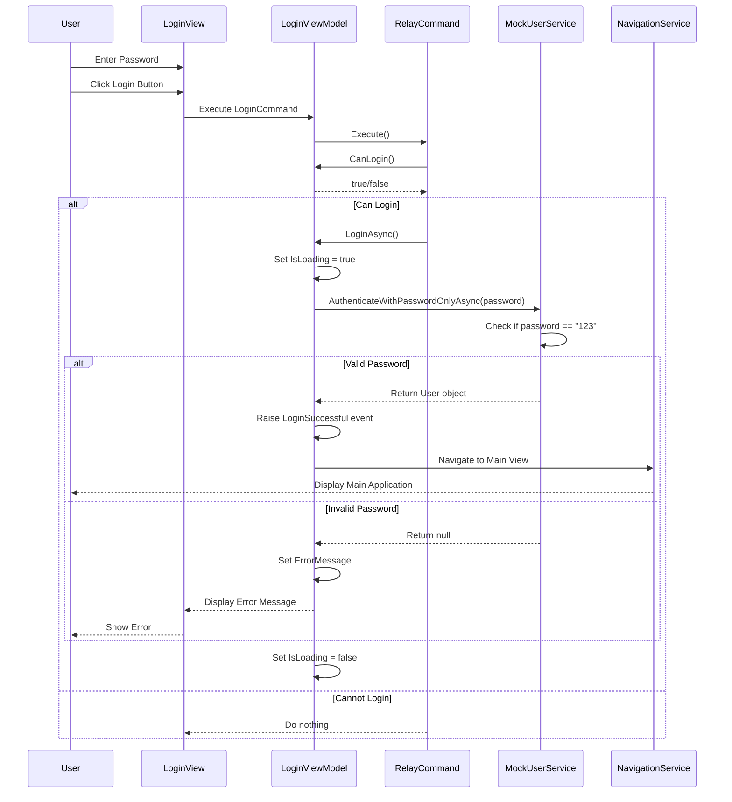

# Login Implementation Technical Documentation

This document provides a detailed technical overview of the login code implementation in the Khouissi-Caisse application.

## Class Diagram



## Login Sequence Diagram



## Code Implementation Details

### 1. MockUserService Implementation

```csharp
public class MockUserService : IUserService
{
    private readonly List<User> _users;
    
    public MockUserService()
    {
        // Initialize with default users with password "123"
        _users = new List<User>
        {
            new User { Id = 1, FirstName = "Admin", LastName = "User", Username = "admin", Password = "123", Role = "Admin", IsActive = true },
            new User { Id = 2, FirstName = "Standard", LastName = "User", Username = "user", Password = "123", Role = "User", IsActive = true }
        };
    }
    
    public async Task<User> AuthenticateWithPasswordOnlyAsync(string password)
    {
        // Simple mock authentication that checks only the password
        var user = _users.FirstOrDefault(u => u.Password == password && u.IsActive);
        return await Task.FromResult(user);
    }
    
    // Other methods implementation...
}
```

### 2. LoginViewModel Implementation

```csharp
public class LoginViewModel : ViewModelBase
{
    private readonly IUserService _userService;
    private string _password = string.Empty;
    private string _errorMessage = string.Empty;
    private bool _isLoading;
    
    public string Password
    {
        get => _password;
        set => SetProperty(ref _password, value);
    }
    
    public string ErrorMessage
    {
        get => _errorMessage;
        set => SetProperty(ref _errorMessage, value);
    }
    
    public bool IsLoading
    {
        get => _isLoading;
        set => SetProperty(ref _isLoading, value);
    }
    
    public ICommand LoginCommand { get; }
    public ICommand CancelCommand { get; }
    
    public event EventHandler<User>? LoginSuccessful;
    
    public LoginViewModel(IUserService userService)
    {
        _userService = userService ?? throw new ArgumentNullException(nameof(userService));
        LoginCommand = new RelayCommand(
            async _ => {
                if (CanLogin())
                    await LoginAsync();
            },
            _ => CanLogin()
        );
        CancelCommand = new RelayCommand(_ => CancelLogin());
    }
    
    private bool CanLogin()
    {
        return !string.IsNullOrWhiteSpace(Password) && !IsLoading;
    }
    
    private async Task LoginAsync()
    {
        ErrorMessage = string.Empty;
        IsLoading = true;
        
        try
        {
            var user = await _userService.AuthenticateWithPasswordOnlyAsync(Password);
            
            if (user != null)
            {
                LoginSuccessful?.Invoke(this, user);
            }
            else
            {
                ErrorMessage = Application.Current.Resources["InvalidCredentials"]?.ToString() ?? "Invalid password";
            }
        }
        catch (Exception ex)
        {
            ErrorMessage = $"Error: {ex.Message}";
        }
        finally
        {
            IsLoading = false;
        }
    }
    
    private void CancelLogin()
    {
        Password = string.Empty;
        ErrorMessage = string.Empty;
        IsLoading = false;
    }
}
```

### 3. RelayCommand Implementation

```csharp
public class RelayCommand : ICommand
{
    private readonly Action<object> _execute;
    private readonly Predicate<object> _canExecute;
    
    public RelayCommand(Action<object> execute, Predicate<object> canExecute = null)
    {
        _execute = execute ?? throw new ArgumentNullException(nameof(execute));
        _canExecute = canExecute;
    }
    
    public bool CanExecute(object parameter)
    {
        return _canExecute == null || _canExecute(parameter);
    }
    
    public void Execute(object parameter)
    {
        _execute(parameter);
    }
    
    public event EventHandler CanExecuteChanged
    {
        add => CommandManager.RequerySuggested += value;
        remove => CommandManager.RequerySuggested -= value;
    }
    
    public void RaiseCanExecuteChanged()
    {
        CommandManager.InvalidateRequerySuggested();
    }
}
```

### 4. View Implementation (LoginView.xaml.cs)

```csharp
public partial class LoginView : UserControl
{
    public LoginView()
    {
        InitializeComponent();
        Loaded += LoginView_Loaded;
    }
    
    private void LoginView_Loaded(object sender, RoutedEventArgs e)
    {
        if (DataContext is LoginViewModel vm)
        {
            PasswordBox.Focus();
        }
    }
    
    private void PasswordBox_PasswordChanged(object sender, RoutedEventArgs e)
    {
        if (DataContext is LoginViewModel vm)
        {
            vm.Password = PasswordBox.Password;
        }
    }
    
    private void LoginButton_Click(object sender, RoutedEventArgs e)
    {
        if (DataContext is LoginViewModel vm && vm.LoginCommand.CanExecute(null))
        {
            vm.LoginCommand.Execute(null);
        }
    }
    
    private void PasswordBox_KeyDown(object sender, KeyEventArgs e)
    {
        if (e.Key == Key.Enter && DataContext is LoginViewModel vm && vm.LoginCommand.CanExecute(null))
        {
            vm.LoginCommand.Execute(null);
        }
    }
}
```

## Data Flow

1. **Input Handling**:
   - Password entered via PasswordBox
   - PasswordBox.Password bound to LoginViewModel.Password property via code-behind
   - Login triggered via button click or Enter key press

2. **Command Execution**:
   - RelayCommand checks if login can execute (CanLogin())
   - If valid, executes the LoginAsync() method

3. **Authentication**:
   - LoginViewModel calls MockUserService.AuthenticateWithPasswordOnlyAsync()
   - MockUserService checks if password matches "123"
   - Returns User object or null based on match

4. **Result Handling**:
   - Success: Raise LoginSuccessful event, navigate to main view
   - Failure: Display error message
   - Always: Reset IsLoading state

5. **Navigation**:
   - NavigationService creates and shows the appropriate view
   - Sets proper DataContext for the new view

## Error Handling

- Input validation: Empty passwords are rejected via CanLogin() check
- Authentication failures: Appropriate error messages are displayed
- Exceptions: Caught and displayed to user with detailed message
- Loading state: Properly managed to prevent multiple login attempts
